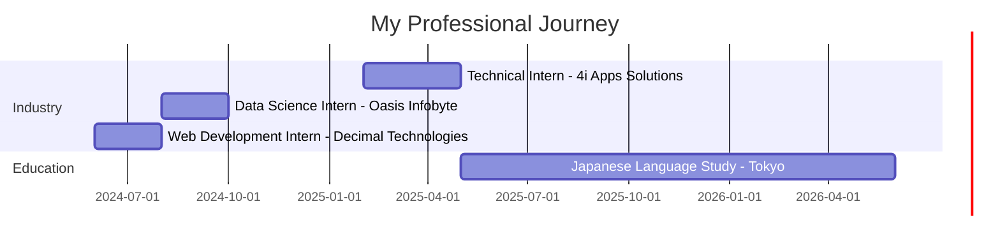

<div align="center">


# 👋 Hey there! I'm **Rashel Garg**

### 🤖 AI/ML Engineer • 🌐 Full-Stack Developer • 📊 Data Science Enthusiast


[](mailto:rasheljob2025@gmail.com)
[](https://github.com/RashelGarg)
[](https://rashelgarg.tech)
[](https://www.linkedin.com/in/rashelgarg/)
[](#)

</div>

---

## 🌸 About Me

```python
class RashelGarg:
    def __init__(self):
        self.name = "Rashel Garg"
        self.location = "Tokyo, Japan 🗼"
        self.citizenship = "India 🇮🇳"
        self.education = "B.Tech in Computer Science with Data Science @ VIT Vellore"
        self.current_role = ["AI/ML Engineer", "Full-Stack Developer", "Data Scientist"]
        self.languages = ["English", "Hindi", "Japanese (JLPT N3)"]
        
    def current_mission(self):
        return "Bridging technology and culture while building intelligent systems in Tokyo"
    
    def fun_fact(self):
        return "Learning Japanese through code and building apps to help others do the same! 🎌"
```

I'm a **Computer Science graduate from VIT Vellore** currently based in **Tokyo, Japan**, where I'm immersing myself in Japanese language and culture while honing my technical skills. I'm passionate about **machine learning**, **web development**, and creating tools that solve real-world problems.

---

## 🗼 What I'm Doing in Tokyo

<div align="center">

</div>

🎓 **Studying Japanese** at Nichibei Kaiwa Gakuin (currently at **JLPT N3 level**)  
💻 **Building projects** that blend technology with Japanese culture  
🌏 **Exploring** the intersection of AI/ML in one of the world's most tech-forward cities  
🚀 **Preparing** for my next role in AI/ML Engineering or Data Science  

---

## 🛠️ Tech Stack & Skills

<div align="center">

### 💻 Languages


### 🧠 AI/ML & Data Science


### 🛠️ Tools & Environments


### Core Computer Science
**Data Structures & Algorithms** • **Database Management Systems** • **Operating Systems** • **System Design** • **Network Security**

</div>

---

## 🚀 Featured Projects

<div align="center">

</div>

### 📱 **KanjiDictApp - Japanese Kanji Learning Companion**

<details open>
<summary><b>Click to expand</b></summary>

```
🎌 Bridging Technology & Japanese Language Learning
```

A **React Native mobile app** designed to help Japanese learners master kanji through interactive, visual learning. Built during my time in Tokyo, this project reflects my passion for both technology and Japanese culture.

**✨ Key Features:**
- 📸 **Camera-based Kanji Scanner** - Snap a photo, instantly recognize kanji
- 🔤 **Furigana Display System** - Automatic reading aids for complex characters
- ✍️ **Stroke Order Animations** - Learn proper kanji writing techniques
- 📚 **Comprehensive Vocabulary Tools** - Words, compounds, and example sentences
- 💾 **Offline CSV Dataset** - Works without internet connection

**🛠️ Tech Stack:**
- React Native (cross-platform mobile development)
- Computer Vision for character recognition
- Custom dataset processing and management
- Scaffolded with Antigravity framework

**🎯 Impact:**
- Inspired by Shirabe Jisho's intuitive design
- Solves real problems I faced while learning Japanese in Tokyo
- Combines ML, mobile dev, and UX design

**📍 Status:** Active development | Personal passion project

</details>

---

### 📈 **Index Fund Price Trend Prediction**

<details>
<summary><b>Click to expand</b></summary>

**🔮 Predicting Market Trends with Deep Learning**

Built a sophisticated **LSTM-based model** to forecast index fund price movements with real-time visualization.

**Tech Stack:**
- Python, LSTM Neural Networks
- TwelveData API (real-time financial data)
- Plotly (interactive candlestick charts)

**Results:**
- ✅ **15% accuracy improvement** over baseline models
- 📊 Real-time candlestick chart generation
- 🎯 Temporal pattern recognition in financial data

</details>

---

### 🚦 **Real-Time Traffic Sign Detection**

<details>
<summary><b>Click to expand</b></summary>

**🚗 Computer Vision for Autonomous Driving**

Developed a **YOLOv8-powered system** for real-time traffic sign detection and classification.

**Tech Stack:**
- Python, YOLOv8, OpenCV, PyTorch
- Custom training pipeline
- Real-time video processing

**Performance:**
- ✅ **95%+ accuracy** on test dataset
- ⚡ **30+ FPS inference** on standard hardware
- 🎯 Robust detection across lighting conditions

</details>

---

### 🔐 **Smart Door Unlocking System**

<details>
<summary><b>Click to expand</b></summary>

**🤖 Multimodal Biometric Authentication**

Created a dual-authentication system combining **face recognition** and **voice verification** for enhanced security.

**Tech Stack:**
- Python, OpenCV, dlib
- Resemblyzer (voice embeddings)
- NLP for voice command processing

**Features:**
- 👤 Face detection with liveness verification
- 🎤 Voice authentication using speaker embeddings
- 🔒 Improved security through multimodal fusion

</details>

---

### 📊 **Exam Answer Evaluation using LLM**

<details>
<summary><b>Click to expand</b></summary>

**🤖 Automated Multi-Judge Grading Pipeline**

Built a comprehensive exam evaluation system using Large Language Models to automate and standardize the grading process.

**Tech Stack:**
- Python, Google Gemini SDK (Generative AI)
- Pandas, NumPy (Data processing)
- Matplotlib, Seaborn (Visual Analytics)
- Scikit-learn (Metric evaluation)

**Key Features & Results:**
- ✅ **Automated multi-judge pipeline** for unbiased, consistent exam grading
- 🛡️ **Advanced rate-limiting** to manage free-tier API quotas effectively
- 📊 **Dynamic dashboards** generating visual insights into student performance
- ⚡ **Seamless migration** to the latest Google Gemini API for enhanced accuracy

</details>

---

## 💼 Professional Experience

<div align="center">



</div>

### 👨‍💻 **Technical Intern** | 4i Apps Solutions
- Built **responsive payslip web page** for employee portal
- Enhanced UI/UX for internal HR systems
- Collaborated with cross-functional teams

### 📊 **Data Science Intern** | Oasis Infobyte
- Developed **5 production-ready ML models**
- Achieved **95% accuracy** on car price prediction
- Reduced RMSE by **20%** through feature engineering

### 🌐 **Web Development Intern** | Decimal Technologies
- Mastered **HTML, CSS, JavaScript** fundamentals
- Explored modern frameworks and responsive design
- Built interactive web components

---

## 📊 GitHub Stats

<div align="center">


</div>

---

## 🎯 Current Focus

<div align="center">

</div>

```yaml
learning:
  - Advanced Deep Learning architectures
  - React Native mobile development
  - Japanese language (targeting JLPT N2)
  - System Design for scalable applications

building:
  - KanjiDictApp (production release)
  - Personal portfolio website
  - ML project portfolio

exploring:
  - GenAI and LLM applications
  - Computer Vision in edge devices
  - Cross-cultural tech solutions
```

---

## 🏆 Certifications

<div align="center">

| Certification | Issuer | Year |
|---------------|--------|------|
| ☁️ **AWS Cloud Practitioner** | Amazon Web Services | 2024 |
| 🤖 **Introduction to Generative AI** | Google Cloud | 2024 |
| 📊 **Statistical Inference** | Johns Hopkins University | 2023 |

</div>

---

## 🎨 Tech I Love

<div align="center">

**🧠 Machine Learning** | **📱 Mobile Development** | **🌐 Web Technologies**  
**☁️ Cloud Computing** | **🎌 Japanese Language Tech** | **📊 Data Visualization**


</div>

---

## 📬 Let's Connect!

<div align="center">

I'm always excited to collaborate on interesting projects, especially those involving **AI/ML**, **data science**, or **Japanese language technology**!

[](mailto:rasheljob2025@gmail.com)
[](https://github.com/RashelGarg)
[](https://www.linkedin.com/in/rashelgarg/)

---

### 💡 *"Code is poetry written for machines, but read by humans"*


---

 <em><b>Thanks for visiting!</b> Feel free to explore my repositories and reach out if you'd like to collaborate!</em>

</div>
